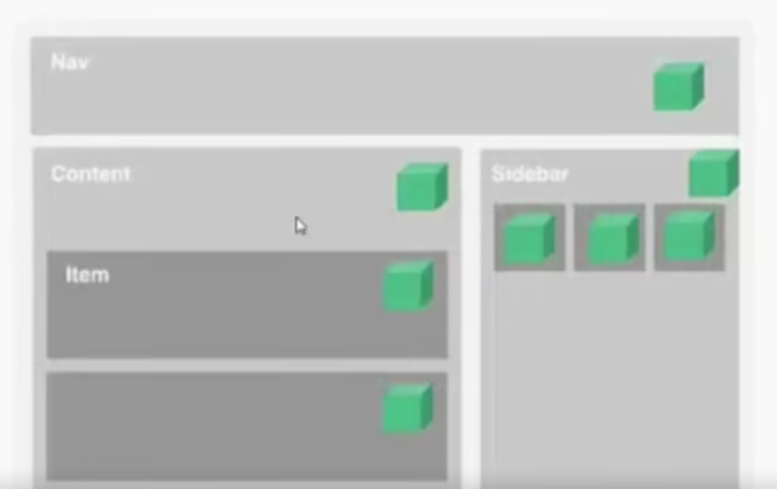
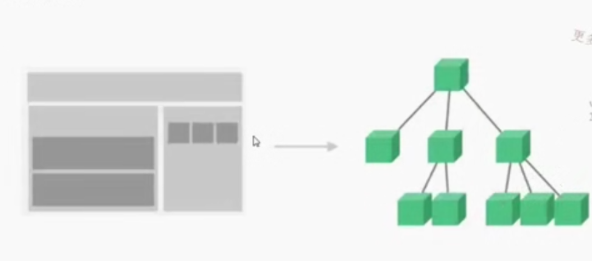

# 课程目录

## 第01章 课程介绍

### 01-01 课程-导学

------

#### Vue框架对比

Vue框架的对比

* Angular提供的更多是一整套解决方案，后者更像是一个生态
* Vue和React目前都使用了Virtual DOM


> Vue

* 模板和渲染函数的弹性选择
* 简单的语法及项目创建
* 更快的渲染速度和更小的体积

> React （facebook团队）

* 更适合用于大型应用和更好的可测试性
* 同时适用于Web端和原生App
* 更大的生态圈带来的更多支持和工具

Vue和React相同点

* 利用虚拟DOM实现快速渲染
* 轻量级
* 响应式组件
* 服务器端渲染
* 易于集成路由工具，打包工具以及状态管理工具
* 优秀是支持和社区

#### 01-02 前端框架回顾

模块化的开发框架

* require.js 减轻文件加载，按模块化划分式结构更加清晰
* jquery DOM操作，ajax,jsp,丰富的函数库，方便操作

#### 01-03 vue概况以及核心思想

* 2013年底作为尤雨溪个人实验项目开发
* 2014年2月份公开发布
* 2014年11月发布0.11版本
* 截至目前经历的版本 vue0.11,vue1.0,vue2.0
* 发布到github，得到了更大的影响力

> Vue本身并不是一个框架
> Vue结合周边的生态构成一个更灵活的、渐进式的框架


> 核心思想

* 数据驱动：DOM操作数据层面
* 组件化

通过MVVM的数据绑定实现自动同步


Vue组件化



Vue组件树



Vue如何实现双向数据绑定？

* Object.defineProperty()函数

```javascript
 <input type="text" id="userName">
  <span id="userNameText"></span>
  <script>
    var obj={
      pwd:'123456'
    };
    Object.defineProperty(obj,"username",{
      get:function(){
      },
      set:function(val){
        document.getElementById('userNameText').innerText=val;
        document.getElementById('userName').value=val;
      }
    })
    document.getElementById("userName").addEventListener('keyup',function(){
      obj.username=event.target.value
    })
  </script>
```

#### 01-04 vue框架优缺点对比

前端：vue.js,axios,vuex,util,公共组件，vue-cli,webpack
后端：Node+Express的后端接口开发
数据库：MongoDB等数据库知识
Vue+Node部署到生产环境

## 第02章 Vue基础

### 02-01 nodejs和npm的安装和环境搭建

### 02-02 vue环境搭建以及vue-cli使用

Vue多页面应用文件引用

* 官网拷贝：
* npm 安装

vue-cli构建SPA应用

* npm install -g vue-cli
* vue init webpack-simple demo
* vue init webpack

### 02-03 vue配置介绍

### 02-04 vue配置

### 02-05 vue基础语法.mp4

## 第03章 Vue-router

### 03-01 路由基础介绍.mp4

### 03-02 动态路由匹配.mp4

### 03-03 嵌套路由.mp4

### 03-04 编程式路由.mp4

### 03-05 命名路由和命名视图.mp4

## 第04章 Vue-resource/Axios

### 04-01 Vue-Resource使用（上）.mp4

### 04-02 Vue-Resource使用（下）.mp4

### 04-03 axios基础介绍.mp4

## 第05章 ES6常用语法

### 05-01 ES6简介.mp4

### 05-02 ES6常用命令.mp4

### 05-03 拓展参数讲解.mp4

### 05-04 Promise讲解.mp4

### 05-05 ES6模块化开发讲解.mp4

### 05-06 AMD、CMD、CommonJS和ES6差异.mp4

## 第06章 商品列表模块实现

### 06-01 商品列表组件拆分.mp4

### 06-02 商品列表数据渲染实现.mp4

### 06-03 实现图片懒加载.mp4

## 第07章 Node.js基础

### 07-01 Linux环境下配置Node环境.mp4

### 07-02 创建http Server容器.mp4

### 07-03 通过node加载静态页面.mp4

### 07-04 搭建基于Express框架的运行环境.mp4

## 第08章 MongoDB介绍

### 08-01 window平台下MongoDB的安装和环境搭建.mp4

### 08-02 Linux平台下安装配置MongoDB.mp4

### 08-03 给MongoDB创建用户.mp4

### 08-04 MongoDB基本语法.mp4

### 08-05 表数据设计和插入.mp4

## 第09章 基于Node.js开发商品列表接口

### 09-01 Node的启动和调试方式.mp4

### 09-02 基于Express实现商品列表查询接口.mp4

### 09-03 商品列表分页和排序功能实现(上).mp4

### 09-04 商品列表分页和排序功能实现（下）.mp4

### 09-05 价格过滤功能实现.mp4

### 09-06 加入购物车功能实现.mp4

## 第10章 登录模块实现

### 10-01 登录功能实现.mp4

### 10-02 登出功能实现.mp4

### 10-03 登录拦截.mp4

### 10-04 全局模态框组件实现.mp4

## 第11章 购物车模块实现

### 11-01 购物车列表功能实现.mp4

### 11-02 商品删除功能实现.mp4

### 11-03 商品修改功能实现.mp4

### 11-04 购物车全选和商品实时计算功能实现.mp4

## 第12章 地址模块实现

### 12-01 地址列表渲染实现 (上).mp4

### 12-02 地址列表渲染功能实现（下）.mp4

### 12-03 地址列表切换和展开功能实现.mp4

### 12-04 地址设置默认功能实现.mp4

### 12-05 地址删除功能实现.mp4

## 第13章 订单确认模块实现

### 13-01 订单确认列表渲染功能实现.mp4

### 13-02 创建订单功能实现.mp4

## 第14章 订单成功模块实现

### 14-01 订单成功页面功能实现.mp4

## 第15章 基于Vuex改造登录和购物车数量功能

### 15-01 Vuex基本介绍.mp4

### 15-02 Vuex的语法讲解.mp4

### 15-03 通过Vuex实现登录和购物车数量（上）.mp4

### 15-04 通过Vuex实现登录和购物车数量（下）.mp4

## 第16章 Webpack使用

### 16-01 webpack基础介绍.mp4

### 16-02 插件静态部分实现.mp4

### 16-03 插件功能实现.mp4

### 16-04 webpack打包功能实现（上）.mp4

### 16-05 webpack打包功能实现（下）.mp4

### 16-06 npm插件发布.mp4

### 16-07 webpack多页面构建(上).mp4

### 16-08 webpack多页面构建（下）.mp4

### 16-09 webpack多页面构建-第三方库.mp4

### 16-10 webpack多页面构建-抽取公共模块.mp4

## 第17章 线上部署

### 17-01 线上部署（上）.mp4

### 17-02 线上部署（中）.mp4

### 17-03 线上部署（下）.mp4

## 第18章 课程总结

### 18-01 课程总结.mp4