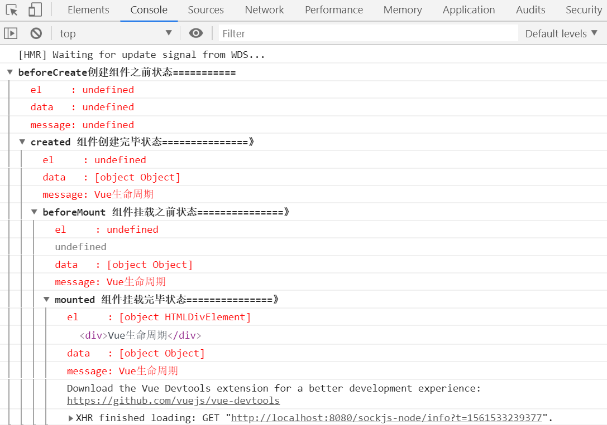
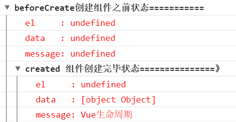
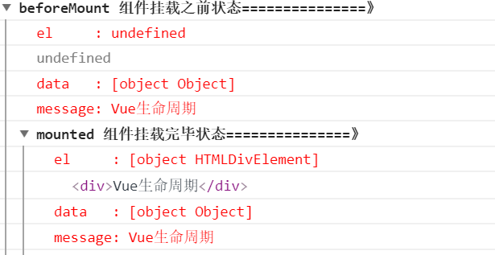
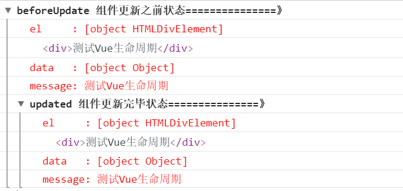
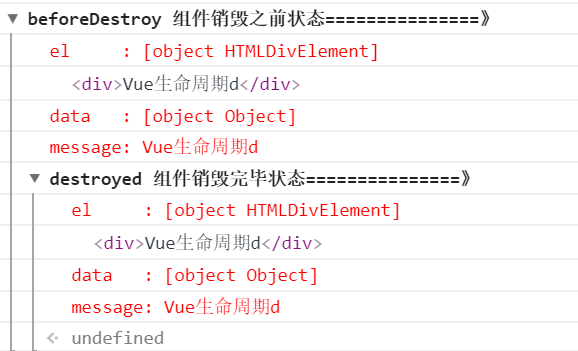

# 了解Vue组件的生命周期

>在使用 `Vue` 进行日常开发中，我们总有这样的需求，我就想在页面刚一加载出这个表格组件时就发送请求去后台拉取数据，亦或者我想在组件加载前显示个`loading`图，当组件加载出来就让这个`loading`图消失等等这样或那样的需求，要实现这些需求，最重要的一点就是我怎么知道这个组件什么时候加载，换句话说我该什么时候向后台发送请求，为了解决这种问题，组件的生命周期钩子函数就应运而生。
## 生命周期图示


这是官方文档给出的一个组件从被创建出来到最后被销毁所要经历的一系列过程，所以这个过程也叫做一个组件的生命周期图。从图中我们可以看到，一个组件从被创建到最后被销毁，总共要经历以下8个过程：

  1. beforeCreate:组件创建之前
  2. created：组件创建完毕
  3. beforeMount：组件挂载之前
  4. mounted：组件挂载完毕
  5. beforeUpate：组件更新之前
  6. upated：组件更新完毕
  7. beforeDestoy：组件销毁之前
  8. destoyed：组件销毁完毕

## 代码演示

```javascript
export default {
  name: "Home",
  data() {
    return {
      message: "Vue生命周期"
    };
  },
  //beforeCreate:组件创建之前
  beforeCreate() {
    console.group("beforeCreate创建组件之前状态===========");
    console.log("%c%s", "color:red", "el     : " + this.$el);
    console.log("%c%s", "color:red", "data   : " + this.$data);
    console.log("%c%s", "color:red", "message: " + this.message);
  },
  //组件创建完毕
  created() {
    console.group("created 组件创建完毕状态===============》");
    console.log("%c%s", "color:red", "el     : " + this.$el);
    console.log("%c%s", "color:red", "data   : " + this.$data);
    console.log("%c%s", "color:red", "message: " + this.message);
  },
  // 组件挂载之前
  beforeMount() {
    console.group("beforeMount 组件挂载之前状态===============》");
    console.log("%c%s", "color:red", "el     : " + this.$el);
    console.log(this.$el);
    console.log("%c%s", "color:red", "data   : " + this.$data);
    console.log("%c%s", "color:red", "message: " + this.message);
  },
  // 组件挂载完毕
  mounted() {
    console.group("mounted 组件挂载完毕状态===============》");
    console.log("%c%s", "color:red", "el     : " + this.$el);
    console.log(this.$el);
    console.log("%c%s", "color:red", "data   : " + this.$data);
    console.log("%c%s", "color:red", "message: " + this.message);
  },
  // 组件更新之前
  beforeUpdate() {
    console.group("beforeUpdate 组件更新之前状态===============》");
    console.log("%c%s", "color:red", "el     : " + this.$el);
    console.log(this.$el);
    console.log("%c%s", "color:red", "data   : " + this.$data);
    console.log("%c%s", "color:red", "message: " + this.message);
  },
  // 组件更新完毕
  updated() {
    console.group("updated 组件更新完毕状态===============》");
    console.log("%c%s", "color:red", "el     : " + this.$el);
    console.log(this.$el);
    console.log("%c%s", "color:red", "data   : " + this.$data);
    console.log("%c%s", "color:red", "message: " + this.message);
  },
  // 组件销毁之前
  beforeDestroy() {
    console.group("beforeDestroy 组件销毁之前状态===============》");
    console.log("%c%s", "color:red", "el     : " + this.$el);
    console.log(this.$el);
    console.log("%c%s", "color:red", "data   : " + this.$data);
    console.log("%c%s", "color:red", "message: " + this.message);
  },
  // 组件销毁完毕
  destroyed() {
    console.group("destroyed 组件销毁完毕状态===============》");
    console.log("%c%s", "color:red", "el     : " + this.$el);
    console.log(this.$el);
    console.log("%c%s", "color:red", "data   : " + this.$data);
    console.log("%c%s", "color:red", "message: " + this.message);
  }
};
```
运行上面的代码，我们控制台可以看出：


## 各个过程详解

* beforeCreate和created
针对组件创建之前和组件创建完毕这两个过程，我们从控制台打印的结果中可以看出：

在组件创建之前beforeCreate:组件的el和data都未被创建。
在组件创建完毕后created:组件的数据data已经被创建好，但是el还处于未被创建状态。


* beforeMount 和 mounted
针对组件挂载之前和组件挂载完毕这两个过程，我们从控制台打印的结果中可以看出：
在组件挂载之前beforeMount:组件的el就会被创建，但是值得注意的是：
<span style="color:red;font-weight:bold">虽然数据data里的message早已经被创建好，但是它还未被应用到真是的DOM元素中</span>


* beforeUpdate和updated
针对组件更新之前和组件更新完毕这两个过程，我们向控制台中输入以下一行代码：

``` javascript
this.$vm0.message="测试Vue生命周期"
```
接着，我们看下控制台的样子：

从图中我们可以看到，当我们将data里的message值改变之后，会触发组件的beforeUpdate和update钩子函数。

* beforeDestroy和destroyed

针对组件销毁之前和组件销毁完毕这两个过程，我们向控制台中输入以下一行代码：
```javascript
this.$vm0.$destroy()
```
输入之后并回车，控制台发生了如下变化：


到此之后，整个组件便走完了自己的一生，从创建到被销毁，销毁之后，此时该组件将不再受vue管理，组件上的所有事件监听都会被移除，所以指令都会被解绑。

# 组件的调用

## 父组件绑定子组件

父组件

```html
<template>
  <div>
    <index-header></index-header>
  </div>
</template>
```

```javascript

import IndexHeader from "./components/header";
export default {
  name: "Index",
  components: {
    IndexHeader
  }
};
```

子组件

```html
<template>
  <div>
    <h2>子组件部分</h2>
  </div>
</template>
```

```javascript
export default {
  name: "Indexheader",
};
```

## 父组件向子组件传值

父组件

```html
<template>
  <div>
    <index-header :message="message"></index-header>
  </div>
</template>
```

```javascript
<script>
import IndexHeader from "./components/header";
export default {
  name: "Index",
  components: {
    IndexHeader
  },
  data() {
    return {
      message: "我是父组件"
    };
  }
};
</script>
```

子组件

```html
<template>
  <div>
    <h2>子组件部分</h2>
    <p>{{message}}</p>
  </div>
</template>
```

```javascript
export default {
  name: "Indexheader",
  props: {
    message: String
  },
};
```

## 子组件向父组件传值

父组件

```html
<template>
  <div>
    <index-header :message="message" v-on:listenToChildEvent="showMsg"></index-header>
  </div>
</template>
```

```javascript
import IndexHeader from "./components/header";
export default {
  name: "Index",
  components: {
    IndexHeader
  },
  data() {
    return {
      message: "我是父组件"
    };
  },
  methods: {
    showMsg(data) {
      console.log(data);
    }
  }
};
```

子组件

```html
<template>
  <div>
    <h2>子组件部分</h2>
    <p>{{message}}</p>
    <button @click="sendMsg">向父组件传值</button>
  </div>
</template>
```

```javascript
export default {
  name: "Indexheader",
  props: {
    message: String
  },
  methods: {
    sendMsg() {
      this.$emit("listenToChildEvent", "this.message id from child");
    }
  }
};
```
