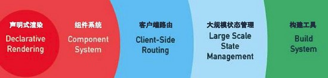

# vue是什么

vue是一套构建用户界面的 **渐进式框架** 。

## 怎样理解什么是渐进式框架

>最初的前端开发中,为了完成某个功能,我们需要通过js在HTML页面中获得dom节点,随后获得dom节点中的文本内容或者在dom节点上添加事件,进行一系列的程序操作,但是,如果任务量很大的情况下,代码会随着业务的增加而变得臃肿和混乱,在现实的开发中,负责的逻辑和巨大的开发量,是原生js无法完成的.

这个时候,开发人员将js代码分为了三个板块:

- 数据(Model)(数据板块只负责数据部分)
- 逻辑控制(*)  (逻辑控制负责联系视图板块和数据板块)
- 视图(View)( 视图板块负责更改样式)

这样子有很大的好处,当需求发生变动时,只需要修改对应的板块就好

这种开发模式,就是所谓的MV* 结构,我们现在了解的 MVC, MVP, MV* 都是 MV* 的衍生物，对比这几种框架模式，我们会总结出来一个本质的特点，那就是这些开发模式都是让视图和数据间不会发生直接联系．对比用原生JS获得dom的操作，你会发现原生dom流其实是将dom作为数据，从dom中获得Model，随后又更改dom来实现更新视图，视图和模型其实混在一起，所以代码自然混乱，不易维护。

在具有响应式系统的Vue实例中，DOM状态只是数据状态的一个映射 即 UI=VM(State) ，当等式右边State改变了，页面展示部分UI就会发生相应改变。

很多人初次上手Vue时，觉得很好用，原因就是这个．不过，Vue的核心定位并不是一个框架，设计上也没有完全遵循MVVM模式，可以看到在图中只有State和View两部分， Vue的核心功能强调的是状态到界面的映射，对于代码的结构组织并不重视， 所以单纯只使用其核心功能时，它并不是一个框架，而更像一个视图模板引擎，这也是为什么Vue开发者把其命名成读音类似于view的原因。

上文提到，Vue的核心的功能，是一个视图模板引擎，但这不是说Vue就不能成为一个框架。如下图所示，这里包含了Vue的所有部件，在声明式渲染（视图模板引擎）的基础上，我们可以通过添加组件系统、客户端路由、大规模状态管理来构建一个完整的框架。更重要的是，这些功能相互独立，你可以在核心功能的基础上任意选用其他的部件，不一定要全部整合在一起。可以看到，所说的“渐进式”，其实就是Vue的使用方式，同时也体现了Vue的设计的理念．



# Vue的初步安装

## Vue-cli安装

```
  $ npm install -g vue-cli
  $ vue init webpack my-project
  $ cd my-project
  $ npm install
  $ npm run dev
```

# 探讨Vue的双向绑定原理以及实现


Vue.js 的核心是一个允许采用简洁的模板语法来声明式地将数据渲染进 DOM 的系统：

## 声明式渲染
```
<div id="app">
  {{ message }}
</div>
```
```javascript
var app = new Vue({
  el: '#app',
  data: {
    message: 'Hello Vue!'
  }
})
```
## 条件与循环
控制切换一个元素是否显示也相当简单：
```
<div id="app-2">
  <p v-if="seen">现在你看到我了</p>
</div>
```

```javascript
var app2 = new Vue({
  el: '#app-2',
  data: {
    seen: true
  }
})
```
`v-for` 指令可以绑定数组的数据来渲染一个项目列表：
```
<div id="app-3">
  <ol>
    <li v-for="todo in todos">
      {{ todo.text }}
    </li>
  </ol>
</div>
```

```javascript
var app4 = new Vue({
  el: '#app-3',
  data: {
    todos: [
      { text: 'JavaScript' },
      { text: 'Vue' },
      { text: 'SPD项目' }
    ]
  }
})
```
## 处理用户输入

```
<div id="app-4">
  <p>{{ message }}</p>
  <input v-model="message">
</div>
```

```javascript
var app6 = new Vue({
  el: '#app-4',
  data: {
    message: 'Hello Vue!'
  }
})
```
# SPD项目中的实例

## elementui的使用
## 
